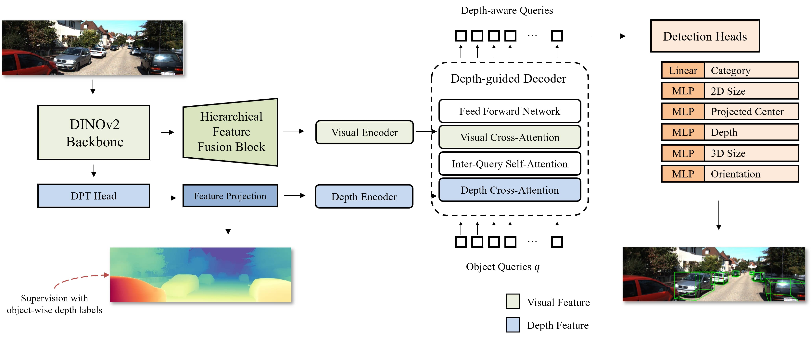

# MonoDINO-DETR:  Depth-Enhanced Monocular 3D Object Detection Using a Vision Foundation Model

Official implementation of 'MonoDINO-DETR: Depth-Enhanced Monocular 3D Object Detection Using a Vision Foundation Model'

## News
* **[2025-01]** The initial code of MonoDINIO-DETR on KITTI is released! :boom:

## Introduction
MonoDINO-DETR is a monocular 3D object detection model and the **first to employ a vision foundation model backbone within a DETR architecture**. By leveraging the [DINOv2](https://github.com/facebookresearch/dinov2) backbone's ability to extract generalized features across diverse vision tasks, it improves the model's performance in both depth and visual feature extraction. For visual feature extraction, the model integrates a Hierarchical Feature Fusion Block for multi-scale detection and 6D Dynamic Anchor Boxes for iterative bounding box refinement, achieving enhanced performance without relying on additional data sources such as LiDAR. For depth features, DINOv2 is paired with a [DPT](https://github.com/isl-org/DPT) head, which is based on the architecture of [Depth Anything V2](https://github.com/DepthAnything/Depth-Anything-V2)—a large-scale pre-trained model for relative depth estimation. By utilizing the pre-trained weights of Depth Anything V2 along with an additional CNN layer, the model achieves better absolute depth estimation, which in turn enhances 3D object detection performance.

* **Overall Structure of MonoDINO-DETR**
<div align="center">
  
</div>

* **Overall Structure of Feature Extraction Module**
<div align="center">
  
</div>

## Main Results

For training, we used 4 NVIDIA TITAN RTX GPUs for 195 epochs with a batch size of 8.

### Comparison of our model with state-of-the-art models on KITTI *val.* set for the car class

**Table Description:** 
- `Mod.` indicates the moderate difficulty level.
- Bold numbers highlight the best results, underlined numbers indicate the second-best results, and blue numbers represent the improvement over them.  
- *Since CaDDN uses a substantial amount of GPU memory, the batch size is set to 2 per GPU across 4 GPUs for CaDDN, and 8 for other models.*


<table>
    <tr>
        <td rowspan="2", div align="center">Method</td>
        <td rowspan="2", div align="center">Extra Data</td>
        <td colspan="3", div align="center">Val, AP<sub>3D</sub></td>   
        <td rowspan="2", div align="center">Time (ms)</td>
    </tr>
    <tr>
        <td div align="center">Easy</td> 
        <td div align="center">Mod.</td> 
        <td div align="center">Hard</td> 
    </tr>
    <tr>
        <td div align="center">CaDDN (CVPR 2021)</td>
        <td div align="center">LiDAR</td>
        <td div align="center">21.91</td> 
        <td div align="center">15.28</td> 
        <td div align="center">13.66</td> 
        <td div align="center">-</td>
    </tr>  
    <tr>
        <td div align="center">MonoDTR (CVPR 2022)</td>
        <td div align="center">LiDAR</td>
        <td div align="center">23.92</td> 
        <td div align="center"><u>18.76</u></td> 
        <td div align="center"><u>15.81</u></td> 
        <td div align="center">-</td>
    </tr>  
    <tr>
        <td div align="center">MonoGround (CVPR 2022)</td>
        <td div align="center">None</td>
        <td div align="center">19.78</td> 
        <td div align="center">14.46</td> 
        <td div align="center">12.42</td> 
        <td div align="center">42</td>
    </tr>  
    <tr>
        <td div align="center">MonoDETR (ICCV 2023)</td>
        <td div align="center">None</td>
        <td div align="center"><u>24.29</u></td> 
        <td div align="center">17.52</td> 
        <td div align="center">15.28</td> 
        <td div align="center">23</td>
    </tr>  
    <tr>
        <td div align="center">MonoCD (CVPR 2024)</td>
        <td div align="center">Planes</td>
        <td div align="center">21.39</td> 
        <td div align="center">15.86</td> 
        <td div align="center">13.09</td> 
        <td div align="center">35</td>
    </tr>  
    <tr>
        <td div align="center"><b>MonoDINO-DETR</b></td>
        <td div align="center">None</td>
        <td div align="center">26.72</td> 
        <td div align="center">19.19</td> 
        <td div align="center">15.92</td> 
        <td div align="center">66</td>
    </tr>  
    <tr>
        <td div align="center"><b>MonoDINO-DETR + DAB</b></td>
        <td div align="center">None</td>
        <td div align="center"><b>27.93</b></td> 
        <td div align="center"><b>19.39</b></td> 
        <td div align="center"><b>15.97</b></td> 
        <td div align="center">74</td>
    </tr>
</table>


## Installation
1. Clone this project and create a conda environment:
    ```
    git clone git@github.com:JihyeokKim/MonoDINO-DETR.git
    cd MonoDINO-DETR

    conda create -n monodinodetr python=3.8
    conda activate monodinodetr
    ```
    
2. Install pytorch and torchvision matching your CUDA version:
    ```bash
    conda install pytorch==1.10.1 torchvision==0.11.2 torchaudio==0.10.1 cudatoolkit=11.3 -c pytorch -c conda-forge
    ```
    
3. Install requirements and compile the deformable attention:
    ```
    pip install -r requirements.txt

    cd lib/models/monodinodetr/ops/
    bash make.sh
    
    cd ../../../..
    ```
    
4. Make dictionary for saving training losses:
    ```
    mkdir logs
    ```
 
5. Download [KITTI](http://www.cvlibs.net/datasets/kitti/eval_object.php?obj_benchmark=3d) datasets and prepare the directory structure as:
    ```
    │MonoDINO-DETR/
    ├──...
    ├──data/KITTIDataset/
    │   ├──ImageSets/
    │   ├──training/
    │   ├──testing/
    ├──...
    ```
    You can also change the data path at "dataset/root_dir" in `configs/monodinodetr.yaml`.

6. Download pre-trained [Depth Anytning V2](https://github.com/DepthAnything/Depth-Anything-V2) model in `checkpoints`.

## Get Started

### Train
You can modify the settings of models and training in `configs/monodinodetr.yaml` and indicate the GPU in `train.sh`:

    bash train.sh configs/monodinodetr.yaml > logs/monodinodetr.log

You can train the model with multiple GPUs:

    bash train.sh configs/monodinodetr.yaml --batch_size 32 --num_gpus 4 > logs/monodinodetr_multi_gpu32.log
   
### Test
The best checkpoint will be evaluated as default. You can change it at "tester/checkpoint" in `configs/monodinodetr.yaml`:

    bash test.sh configs/monodinodetr.yaml


## Acknowlegment
This repo benefits from the excellent [MonoDETR](https://github.com/ZrrSkywalker/MonoDETR) and [Depth-Anything-V2](https://github.com/DepthAnything/Depth-Anything-V2).

## Citation
If you find this project useful, please consider citing:
```bash
not yet published
```

## Contact
If you have any questions about this project, please feel free to contact hanaone110@gmail.com.
